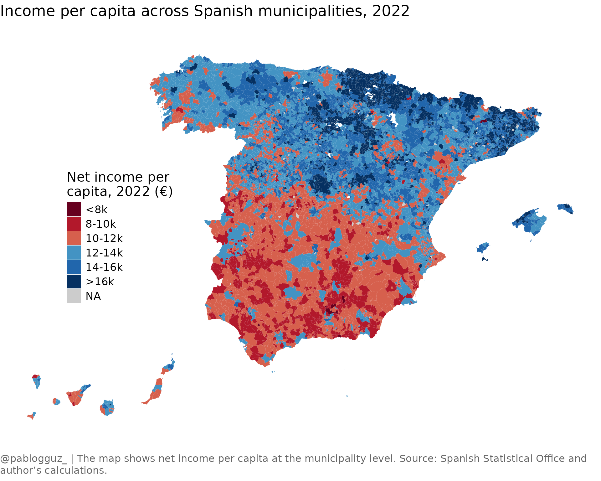

# Creating maps with ineAtlas

This vignette demonstrates how to use `ineAtlas` to create choropleth
maps of socioeconomic indicators across Spanish municipalities.

## Load required packages

First, let’s load the required packages. We will use the
[`mapSpain`](https://ropenspain.github.io/mapSpain/) package to get the
municipality geometries.

``` r
library(ineAtlas)
library(mapSpain)
library(dplyr)
library(ggplot2)
library(ggtext)
```

## Get municipality data

Let’s fetch income data for all Spanish municipalities for the year
2022:

``` r
# Get municipality level income data
mun_data <- get_atlas(
    category = "income",
    level = "municipality"
) %>%
    filter(year == 2022)

# Preview the data
head(mun_data)
#> # A tibble: 6 × 11
#>   mun_code mun_name        prov_code prov_name  year net_income_pc net_income_hh
#>   <chr>    <chr>           <chr>     <chr>     <dbl>         <dbl>         <dbl>
#> 1 01001    Alegría-Dulant… 01        Araba/Ál…  2022         15116         38507
#> 2 01002    Amurrio         01        Araba/Ál…  2022         16011         39221
#> 3 01003    Aramaio         01        Araba/Ál…  2022         20201         51737
#> 4 01004    Artziniega      01        Araba/Ál…  2022         15651         38089
#> 5 01006    Armiñón         01        Araba/Ál…  2022         15755         36433
#> 6 01008    Arratzua-Ubarr… 01        Araba/Ál…  2022         22484         58424
#> # ℹ 4 more variables: net_income_equiv <dbl>, median_income_equiv <dbl>,
#> #   gross_income_pc <dbl>, gross_income_hh <dbl>
```

## Get municipality geometries

Now we’ll get the municipality geometries from `mapSpain`:

``` r
# Get municipality geometries
mun_map <- esp_get_munic_siane() %>%
    # Join with our income data
    left_join(
        mun_data,
        by = c("LAU_CODE" = "mun_code")
    )

# Preview the joined data
glimpse(mun_map)
#> Rows: 8,132
#> Columns: 18
#> $ codauto             <chr> "01", "01", "01", "01", "01", "01", "01", "01", "0…
#> $ ine.ccaa.name       <chr> "Andalucía", "Andalucía", "Andalucía", "Andalucía"…
#> $ cpro                <chr> "04", "04", "04", "04", "04", "04", "04", "04", "0…
#> $ ine.prov.name       <chr> "Almería", "Almería", "Almería", "Almería", "Almer…
#> $ cmun                <chr> "001", "002", "003", "004", "005", "006", "007", "…
#> $ name                <chr> "Abla", "Abrucena", "Adra", "Albanchez", "Albolodu…
#> $ LAU_CODE            <chr> "04001", "04002", "04003", "04004", "04005", "0400…
#> $ geometry            <MULTIPOLYGON [°]> MULTIPOLYGON (((-2.775594 3..., MULTI…
#> $ mun_name            <chr> "Abla", "Abrucena", "Adra", "Albanchez", "Albolodu…
#> $ prov_code           <chr> "04", "04", "04", "04", "04", "04", "04", "04", "0…
#> $ prov_name           <chr> "Almería", "Almería", "Almería", "Almería", "Almer…
#> $ year                <dbl> 2022, 2022, 2022, 2022, 2022, 2022, 2022, 2022, 20…
#> $ net_income_pc       <dbl> 11635, 10927, 9316, 10464, 11054, 9761, 10103, 120…
#> $ net_income_hh       <dbl> 25522, 22066, 25639, 21030, 23237, 26991, 19494, 2…
#> $ net_income_equiv    <dbl> 16511, 15129, 14206, 14958, 15436, 15267, 13757, 1…
#> $ median_income_equiv <dbl> 15050, 13650, 12950, 13650, 14350, 13650, 12250, 1…
#> $ gross_income_pc     <dbl> 13305, 12361, 10650, 11885, 12457, 11545, 11311, 1…
#> $ gross_income_hh     <dbl> 29187, 24962, 29311, 23885, 26187, 31924, 21823, 3…
```

## Create a choropleth map

Let’s create a map showing net income per capita across Spanish
municipalities:

``` r
# Create the map
ggplot(mun_map) +
    geom_sf(
        aes(fill = cut(net_income_pc,
            breaks = c(-Inf, 8000, 10000, 12000, 14000, 16000, Inf),
            labels = c("<8k", "8-10k", "10-12k", "12-14k", "14-16k", ">16k")
        )),
        color = NA
    ) +
    labs(
        title = "Income per capita across Spanish municipalities, 2022",
        caption = "@pablogguz_ | The map shows net income per capita at the municipality level. Source: Spanish Statistical Office and author's calculations."
    ) +
    scale_fill_manual(
        name = "Net income per \ncapita, 2022 (€)",
        values = c("#67001F", "#B2182B", "#D6604D", "#4393C3", "#2166AC", "#053061"),
        na.value = "grey80"
    ) +
    theme_void() +
    theme(
        text = element_text(family = "Open Sans", size = 16),
        plot.title = element_text(size = 18, margin = margin(b = 20)),
        legend.position = c(0.2, 0.5),
        plot.caption = element_textbox_simple(
            size = 12,
            color = "grey40",
            margin = margin(t = 20),
            hjust = 0,
            halign = 0,
            lineheight = 1.2
        )
    )
```



## Identifying high and low income areas

Let’s find the top 10 municipalities by net income per capita:

``` r
mun_data %>%
  arrange(desc(net_income_pc)) %>%
  select(mun_name, net_income_pc) %>%
  head(10) %>%
  mutate(
    net_income_pc = round(net_income_pc, 2)
  )
#> # A tibble: 10 × 2
#>    mun_name                 net_income_pc
#>    <chr>                            <dbl>
#>  1 Pozuelo de Alarcón               29258
#>  2 Oroz-Betelu/Orotz-Betelu         25780
#>  3 Goñi                             25532
#>  4 Matadepera                       24814
#>  5 Bolvir                           24812
#>  6 Boadilla del Monte               24748
#>  7 Palau de Santa Eulàlia           24437
#>  8 Madremanya                       24190
#>  9 Vilamòs                          24052
#> 10 Brull, El                        23957
```

And the bottom 10:

``` r
mun_data %>%
  arrange(net_income_pc) %>%
  select(mun_name, net_income_pc) %>%
  head(10) %>%
  mutate(
    net_income_pc = round(net_income_pc, 2)
  )
#> # A tibble: 10 × 2
#>    mun_name            net_income_pc
#>    <chr>                       <dbl>
#>  1 Odèn                         6274
#>  2 Torre del Burgo              6277
#>  3 Manjarrés                    7146
#>  4 Huesa                        7603
#>  5 Darro                        7712
#>  6 Guadahortuna                 7757
#>  7 Iznalloz                     7777
#>  8 Palmar de Troya, El          7779
#>  9 Albuñol                      7949
#> 10 Palomas                      8036
```
